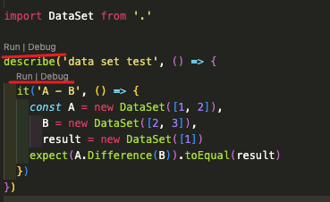

[TOC]
[jest runner]: https://marketplace.visualstudio.com/items?itemName=firsttris.vscode-jest-runner

### 前言

jest 是一个 meta 出品的一个测试框架，我们通常用它来做单元测试；在写一些脱离 UI 的功能时，也可以拿他来做 debug 的工具，在减少我们 debug 的工作量的同时还能提高代码质量。

下面我还是用之前那个操作集合的例子来演示，我是如何用 jest 来 debug 的；

> PS： 你可能需要先安装[jest](https://jestjs.io/docs/getting-started)，和 vscode 的 [jest runner][jest runner]

<!--more-->

### 需求分析

我的需求是假设有任意一个对象的两个新、旧集合，需要计算出他们之间的新增、修改和删除的部分。
$$
\begin{align*}
设：& \\
& 新集合为：A，旧集合为：B \\ 
& 要创建的集合：C， 要更新的集合：U， 要删的除集合：D \\
则：& \\
& C = A - B \\
& D = B - A \\
& U = A \cap B
\end{align*}
$$

### 实现
根据公式得知，我需要实现差集和交集功能。那我先扩展集合类，并新增差集(Difference)和交集(Intersection)两个方法
> index.ts
```ts
export default class DataSet<T> extends Set<T> {
  Difference = (other: DataSet<T>) => {
    const _difference = new DataSet<T>()
    for (const s of this) {
      if (!other.has(s)) {
        _difference.add(s)
      }
    }
    return _difference
  }

  Intersection = (other: DataSet<T>) => {
    const _intersection = new DataSet<T>()
    for (const s of this) {
      if (other.has(s)) {
        _intersection.add(s)
      }
    }
    return _intersection
  }
}
```
下面用jest来做测试，新增一个.test文件
> index.test.ts
```ts
import DataSet from '.'

describe('data set test', () => {
  it('A - B', () => {
    const A = new DataSet([1, 2]),
      B = new DataSet([2, 3]),
      result = new DataSet([1])
    expect(A.Difference(B)).toEqual(result)
  })
})

```
其中describe是这组测试的描述，it是每个用例。我们的测试需要写在它们的回调函数时，这个回调函数提供了运行测试的域（scope）。
如果装了vscode [jest runner][jest runner]插件可以在describe和it上方看到run和debug，点击即可运行和debug


我们点击run运行它，可以看到控制台有如下输出：
```sh
 PASS  src/util/DataSet/index.test.ts
  data set test
    ✓ A - B (2 ms)

----------|---------|----------|---------|---------|-------------------
File      | % Stmts | % Branch | % Funcs | % Lines | Uncovered Line #s 
----------|---------|----------|---------|---------|-------------------
All files |   74.19 |      100 |   66.66 |   74.19 |                   
 index.ts |   74.19 |      100 |   66.66 |   74.19 | 23-30             
----------|---------|----------|---------|---------|-------------------
Test Suites: 1 passed, 1 total
Tests:       1 passed, 1 total
Snapshots:   0 total
Time:        3.74 s, estimated 4 s
Ran all test suites matching /\/Users\/furan\/Code\/newBest\/newseed\/robotapp\/src\/util\/DataSet\/index.test.ts/i with tests matching "data set test".
```

这些输入就是这次测试的成绩单，这些Stmts（语句覆盖）、Branch（判定覆盖率）、Funcs（函数覆盖）、Lines（行覆盖率）是测试的一些指标，Uncovered Line是未覆盖的行。这些指标最好都要达到100。
从Uncovered Line可以看出，代码的22～30行是没执行的。 这是因为我没有测试交集的用例，来完善一下。

> index.test.ts
```ts
import DataSet from '.'

describe('data set test', () => {
  it('A - B', () => {
    const A = new DataSet([1, 2]),
      B = new DataSet([2, 3]),
      result = new DataSet([1])
    expect(A.Difference(B)).toEqual(result)
  })

  it('B - A', () => {
    const A = new DataSet([1, 2]),
      B = new DataSet([2, 3]),
      result = new DataSet([3])
    expect(B.Difference(A)).toEqual(result)
  })

  it('A ∩ B', () => {
    const A = new DataSet([1, 2]),
      B = new DataSet([2, 3]),
      result = new DataSet([2])
    expect(A.Intersection(B)).toEqual(result)
  })
})

```

```sh
 PASS  src/util/DataSet/index.test.ts
  data set test
    ✓ A - B (3 ms)
    ✓ B - A (1 ms)
    ✓ A ∩ B (1 ms)

----------|---------|----------|---------|---------|-------------------
File      | % Stmts | % Branch | % Funcs | % Lines | Uncovered Line #s 
----------|---------|----------|---------|---------|-------------------
All files |     100 |      100 |     100 |     100 |                   
 index.ts |     100 |      100 |     100 |     100 |                   
----------|---------|----------|---------|---------|-------------------
Test Suites: 1 passed, 1 total
Tests:       3 passed, 3 total
Snapshots:   0 total
Time:        3.322 s, estimated 4 s
Ran all test suites matching /\/Users\/furan\/Code\/newBest\/newseed\/robotapp\/src\/util\/DataSet\/index.test.ts/i with tests matching "data set test".
```

完善之后再运行就可以看到全部通过了

### 后话
通过jest我们可以很方便的调试代码，不用把方法绑在UI上，改了还需要热刷新，大大减少了工作量，且用例是可以复用的，在代码改动后，通过单元测试可以快速检验改动的兼容性。可以避免一些改动引起的新bug。


### 附录
#### 参考资料
[测试 - 测试覆盖率](https://www.cnblogs.com/Neeo/articles/11795996.html#%E8%B7%AF%E5%BE%84%E8%A6%86%E7%9B%96%E7%8E%87)
#### QA

##### Q: import enum 报错

在 jest.config 中使用 ts-jest

> ```diff
> - // preset: "react-native",
> + preset: "ts-jest",
> ```
