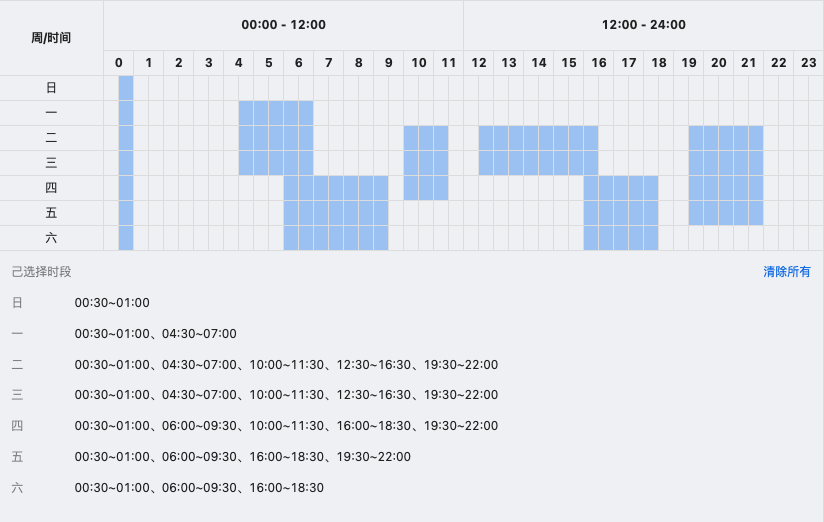
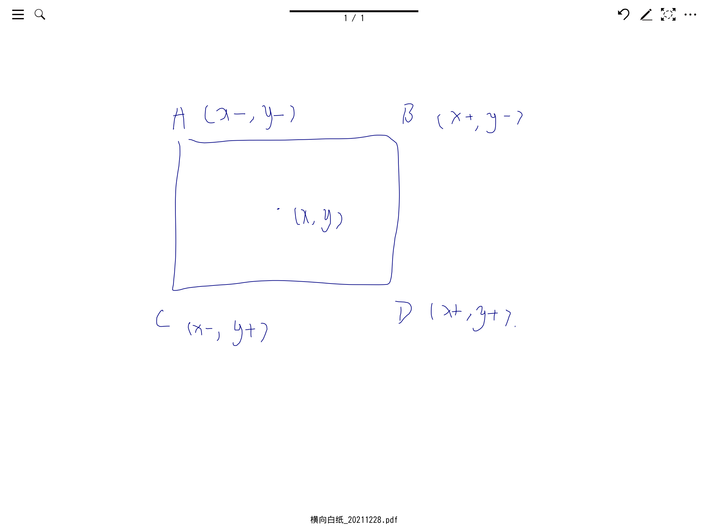

### 目标

> 实现如下图的计划表组件  
> 

有以下几个需求点

1. 支持框选

- 框选要支持吸附

2. 己选择时段那里要合并连续的区间

让我们先就上面需求做一些分解，明确各个功能的边界。
首先`表格`和`框选`两个组件都相对独立，所有应该分别实现两个内聚的组件。  
再根据[Dumb Smart 组件分离][dumb smart component]原则，`表格`和`框选`属于 Dumb 组件，我们还需实现一个 Smart 组件用于匹配二者之间的关系。

### 框选实现 Marquee

框选这里我一开始是使用`position: absolute`实现，

```css
.marquee {
  position: absolute;
  /* 原点 x */
  left: orgin-x;
  /* 原点 y */
  top: orgin-y;
  /* 矩形长度 */
  width: offset-x;
  /* 矩形高度 */
  height: offset-y;
}
```

但是会有一个问题，就是向左上方拖动的时候。你浮动元素的 width 和 height 不能给负数。

所以我就改用`svg + path`来实现

我们先复习下 path 画矩形的 api, 大小写的区别是： 大写是绝对位置、小定是相对位置, 为了方便下方只用大写

| api | 参数 | 说明                       |
| --- | ---- | -------------------------- |
| M   | x,y  | move to 画笔移动到 x, y 点 |
| L   | x,y  | line to 画线画到 x，y 点   |
| V   | y    | 绘制垂直线到 y 点          |
| H   | y    | 绘制水平线到 y 点          |
| Z   |      | 闭环                       |

path 还可以绘制扇形等，但不属于本文范围，故不赘述。

具体的 VM 如下：

```tsx
<div
  style={{ position: "relative", width: "100%", height: "100%" }}
  onMouseDown={onMouseDown}
  onMouseMove={onMouseMove}
  onMouseUp={onMouseUp}
  onMouseLeave={onMouseUp}
  ref={ref}
>
  <svg
    style={{
      position: "absolute",
      width: "100%",
      height: "100%",
      pointerEvents: "none",
      left: 0,
      top: 0,
    }}
  >
    <path
      d={`M ${num(mask.left)} ${num(mask.top)}
          h ${num(mask.width)}
          v ${num(mask.height)}
          h ${-num(mask.width)}
          Z`}
      fill={fill}
      opacity={opacity}
    />
  </svg>
  {children}
</div>
```

简述一下实现，

1. 监听点击事件设置原点。
2. 监听移动事件设置 offset。
3. 监听释放事件结束生命周期

因为 v h 可以支持负数。所以完美解决我们的问题

### 表单实现 Schedule

schedule 本质上就是 table 的 generator，一个二位数据的生成，没啥难度，且因为与下面匹配层有联动，故不赘述。

### 匹配层

想了下匹配层也没啥讲的，说白就是两个矩阵算下偏移量，然后算下相交。

### RangeCombine 算法

讲一下相连时间合并的算法

```ts
while (i < pick.length + 1) {
  i++;
  if (!pick[i]) continue;

  let j = i;
  while (j < pick.length + 1) {
    j++;
    if (!pick[j]) {
      str += `${time(i)}~${time(j)}、`;
      i = j;
      break;
    }
  }
}
```

这里的用的是双指针，i 是慢指针，i 会移动到第一个选中项。然后移动 j，直到 j 也是未选中。输出 i 和 j。

### 吸附实现 sticky 算法

最后有个吸附体验的问题的。

因为我们用 path 绘图，原点是一个点。 由（x，y）两个坐标组成. 但是吸附是一个矩形。 是由四个点组成的。

设四个点为  
A (x-, y-)  
B (x+, y-)  
C (x-, y+)  
D (x+, y+)



意味着你**水平**向左移动的时候，需要吸附 B、D 两个点中的一个；反之则是 A、C。**垂直**向上移动需要吸附 C、D；向下则是 A、B。  
有一种薛定谔的吸附点的感觉。 不过两点才能确定一个面，你必须同时确定水平垂直两个移动方向，才能绘制矩形。  
_归纳一下_  
向左移动，原点的 x 一定是 x+，向右则一定是 x-；  
同理向上移动，原点的 y 一定是 y+，向下则一定是 y-；

吸附算法：  
```ts
const stickyXCeil = (x: number) => (w ? Math.ceil(x / w) * w : x),
  stickyXFloor = (x: number) => (w ? Math.floor(x / w) * w : x),
  stickyYCeil = (y: number) => (h ? Math.ceil(y / h) * h : y),
  stickyYFloor = (y: number) => (h ? Math.floor(y / h) * h : y);
```

[dumb smart component]: (https://segmentfault.com/a/1190000004111786)
