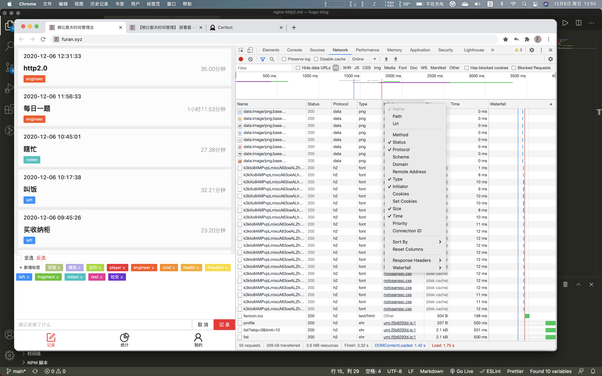

## 起因
今天学网络相关的资料,看到http2对比http1.1,有以下几个好处
- 多路复用 (Multiplexing)
- 二进制分帧
- 首部压缩（Header Compression）
- 服务端推送（Server Push）

[细节参考](https://www.zhihu.com/question/34074946)  

一言蔽之, 快了很多~
<!--more-->
## nginx上配置
首先nginx要1.9以上且在ssl环境下才能开启http2
### 检查版本
```bash
nginx -v
```
### 升级nginx
```
yum update nginx
```

### ssl咋办
[certbot](https://certbot.eff.org/)一键配置ssl+自动更新

### 配置conf
在443端口上加上http2就可以了
```bash
server {
  listen        443 ssl http2;
  ...
}
```

### 重启nginx
```bash
systemctl restart nginx
```

### 验证
打开`chrome` - `f12` - `Network` - `右键` - 勾选`Protocol`  
看到是h2就说明没错了

