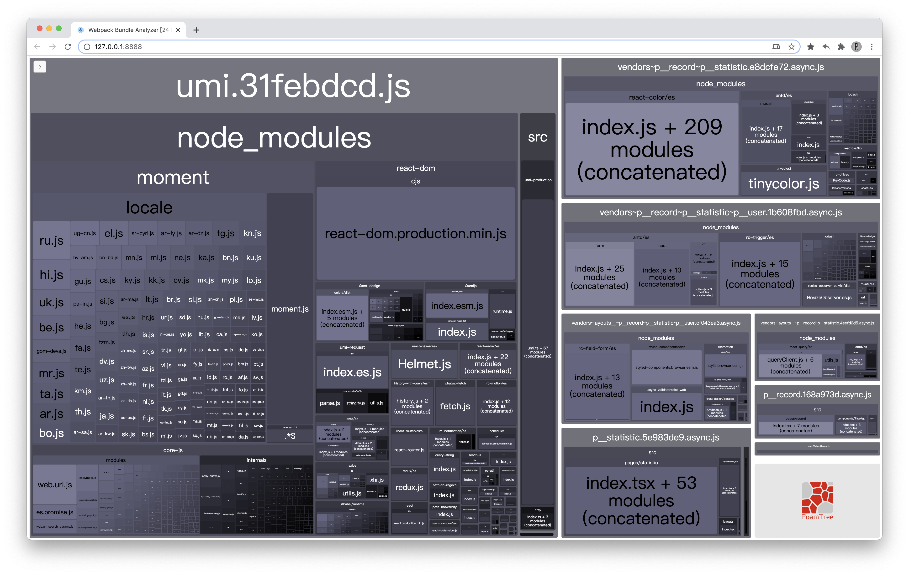
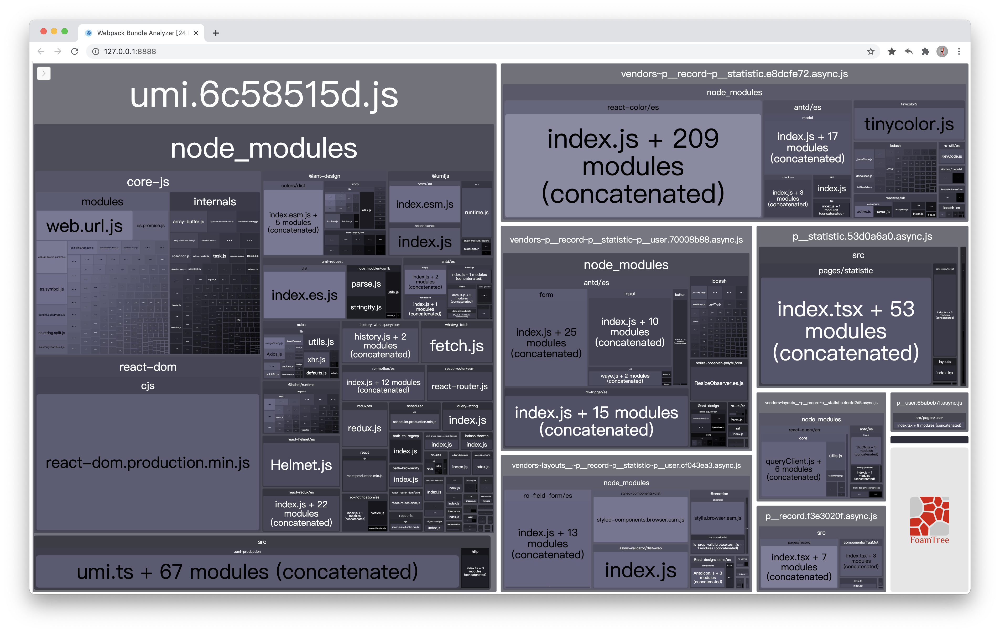

## 前言
> 最近面试老被问CDN, 我心想这玩意不是以前用来引js文件的吗? 现在用npm + webpack代替了. 之前公司也只是用来配合oss做图片、视频这些资源的分发. ~~难道现在前端要自己实现内容分发系统?~~ 后来被提及到可以做优化, 我印象中优化主要是靠`code split`做按需加载, 以及被弃用的`dll`.  
> **so google it**

<!--more-->

- 首先code split分包按需加载在http 1下面也存在同域名最大并发数量的限制, 不同浏览器不一样, 大概是4~6个, 当然你可以升级成http2, [升级参考](https://furan.xyz/post/env/nginx-http2/).
- 第二, 利用CDN的确可以优化首屏加载时间.
- 第三, 可以有效降低主服务器的流量, 流量很贵的~

### 所以, 那些依赖包适合用CDN呢?
- 首屏不依赖的, 就是说可以放在`<body/>`标签里的依赖适合用cdn 
- 外网应用
- CDN提供的是es-module或umd的

## 实践
> 学会自行车的最佳办法, 就是骑上它  

我以一个[个人项目]为例(https://github.com/NgeKaworu/time-mgt-umi3),
我们先分析下项目里哪些包比较大, 我们先安装[Webpack Bundle Analyzer](https://github.com/webpack-contrib/webpack-bundle-analyzer)这个插件

```bash
# NPM
npm install --save-dev webpack-bundle-analyzer
# Yarn
yarn add -D webpack-bundle-analyzer

```

然后打开`.umirc`, 添加以下代码
```js
  // 配置具体含义见：https://github.com/umijs/umi-webpack-bundle-analyzer#options-for-plugin
  analyze: {
    analyzerMode: 'server',
    analyzerPort: 8888,
    openAnalyzer: true,
    // generate stats file while ANALYZE_DUMP exist
    generateStatsFile: false,
    statsFilename: 'stats.json',
    logLevel: 'info',
    defaultSizes: 'parsed', // stat  // gzip
  }
```

然后打开`package.json`, 在加入以下命令
```json
"scripts": {
    "analyze": "cross-env ANALYZE=1 NODE_ENV=production umi build",
}
```

我们执行以下命令`npm run analyze`看看, 执行完后浏览器会打开一个页面显示如下


可以看到`moment`比较大, 而且不是首屏的依赖, 所以我准备通过用cdn的方式引用它.  
继续编辑`.umirc`文件, 加入
```js
  externals: {
    moment: 'moment',
  },
  scripts: [
    'https://lib.baomitu.com/moment.js/latest/moment.min.js',
  ]
```
然后再次`npm run analyze`看看

可以看到moment已经不见了


## 参考资料
[浏览器同域名请求的最大并发数限制](https://cloud.tencent.com/developer/article/1683127)  
[umi文档](https://umijs.org/zh-CN/config)  
[Webpack优化实践，合理分包，降低白屏时间](https://juejin.cn/post/6844904064250019854#heading-0)  