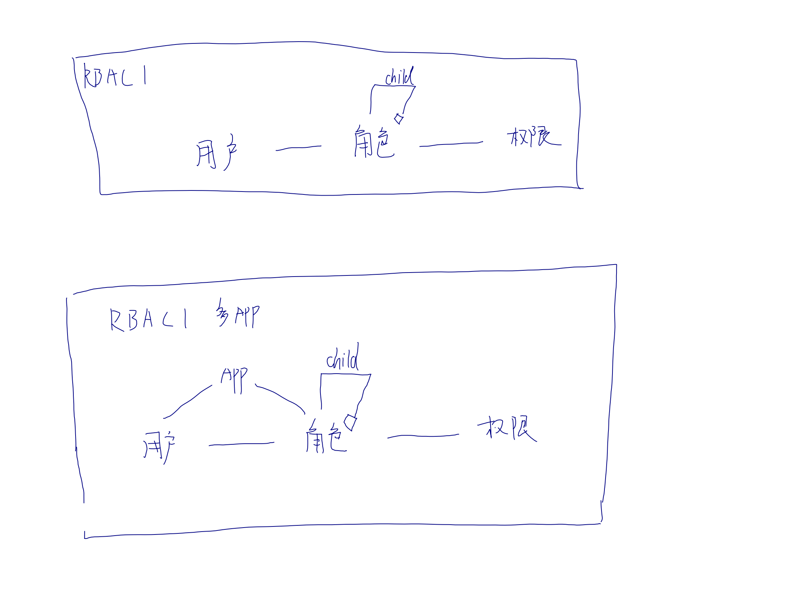
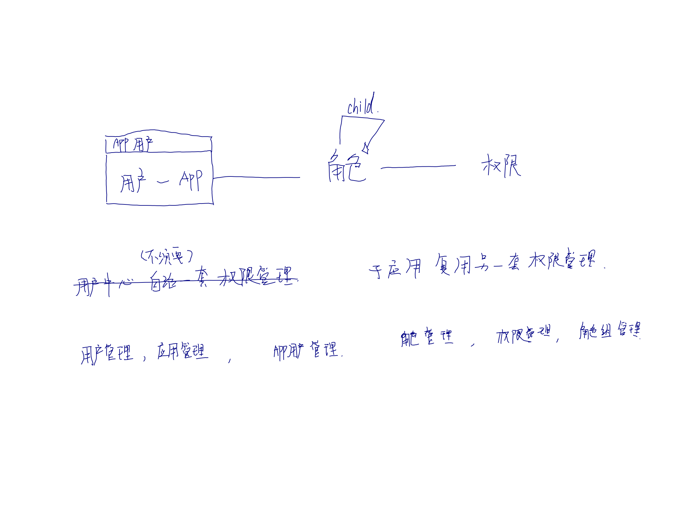
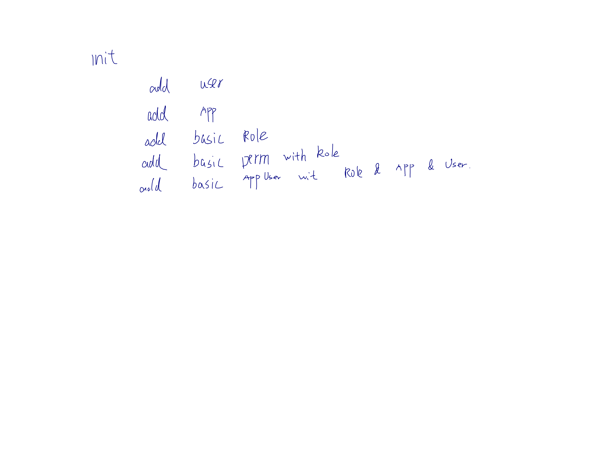
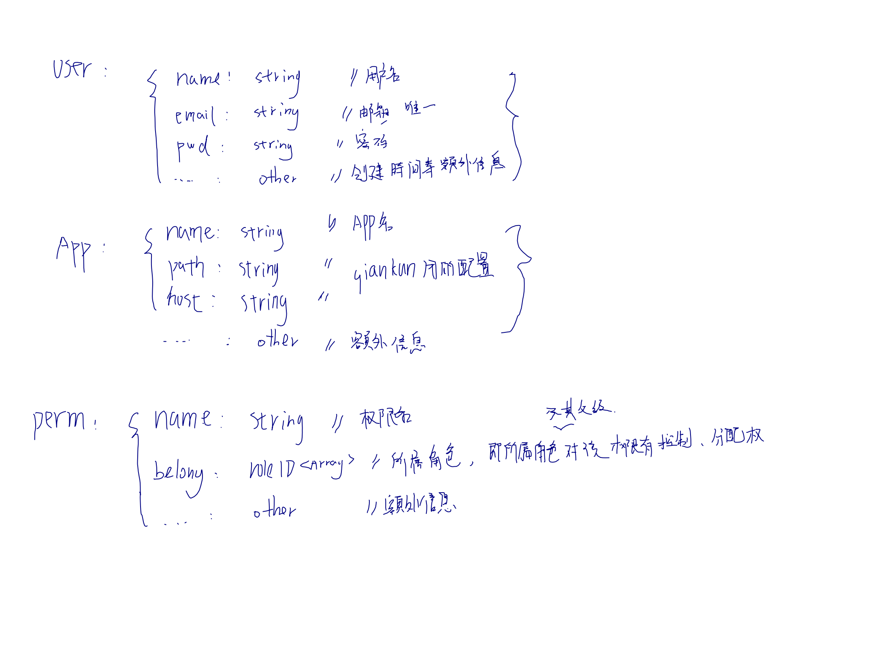
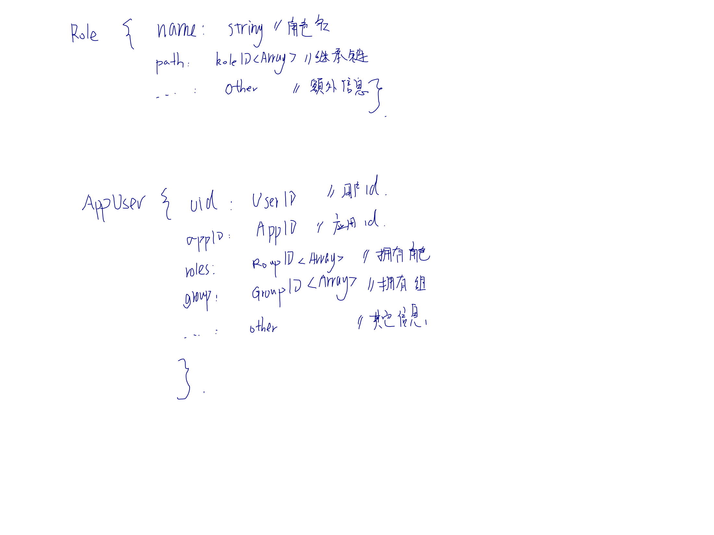

## 前言

最近接触了微前端 qiankun，打算玩下，先把用户中心抽离出来，做单独模块；恰好接触到了 RBAC 模型，就写一篇博文记录。

<!--more-->

## RBAC 是什么？

[RBAC 模型：基于用户-角色-权限控制的一些思考](https://juejin.cn/post/6844903940673241102#heading-2)

## 用户中心的职责

### 初版的职责

- 用户的管理（CURD）（管理员行为）
- JWT 的签发、校验（RPC）
- 登录、注册、修改密码等（用户行为）

起初我认为权限、角色、角色组应该子应用自治。因为过多的自应用权限会让`用户中心`的管理员变得庞大；例如我增加一个`子应用`，增加 100 个权限，我就得给`用户中心`的管理员增加这 100 个权限。非常麻烦。
但是看过`RBAC`标准模型后，我发现`RBAC1`可以代完美解决这个问题。

1. 首先创建一个 root 角色
2. child 角色继承 parent 角色
3. 所有 child 行使的权限，parent 都可以行使
4. 加个角色组方便批处理

### 基于 RBAC1 的职责

- 用户的管理（CURD）（管理员行为）
- JWT 的签发、校验（RPC）
- 登录、注册、修改密码等（用户行为）
- 角色（role）的管理， 可继承
- 权限（permssion）的管理
- 角色组（group）的管理

~~完成解决~~

$$
\begin{matrix}
  最终权限 \in 权限 \cup 角色 \cup 角色组
\end{matrix}
$$

## 并没有解决

RBAC 模型在单系统中是比较标准的解决方案，它帮我解决了如下问题

1. 高级角色拥有低级角色的所有权限
2. 角色的自由扩展
3. 平级角色的隔离

### 但是多系统呢？用户如何隔离？

即 A，B 两个管理员为平级角色，A 管理员只能管理 A 系统的用户，即用户间的隔离。要实现这个我认为有两个方案：

1. 加一层 app 管理。角色和用户都分别和 app 建立关系。
2. 同样加一层 app 管理。但只有用户和 app 建立关系，把关系 id 提供给 app，app 自治自己的权限业务逻辑。

很明显第一种角色、用户、app 间会存在硬耦合，且子系统间的权限逻辑不可见性，很难做到复用。第二种类似于微信公众号设计，即统一的用户是 unicornID，用户和 appID 间存在 openID，openID 提供给 app，让 app 间自治。

## 只能自治吗？

我希望子系统可以复用 RBAC 模型

### 这是基本模型

### 基于 openID 的改良

### 初始化过程

### 表设计

### 组合之后的职责

- 用户的管理（CURD）（管理员行为）
- JWT 的签发、校验（RPC）
- 登录、注册、修改密码等（用户行为）
- 角色（role）的管理， 可继承
- 权限（permssion）的管理
- 角色组（group）的管理
- app的管理
- appUser的管理