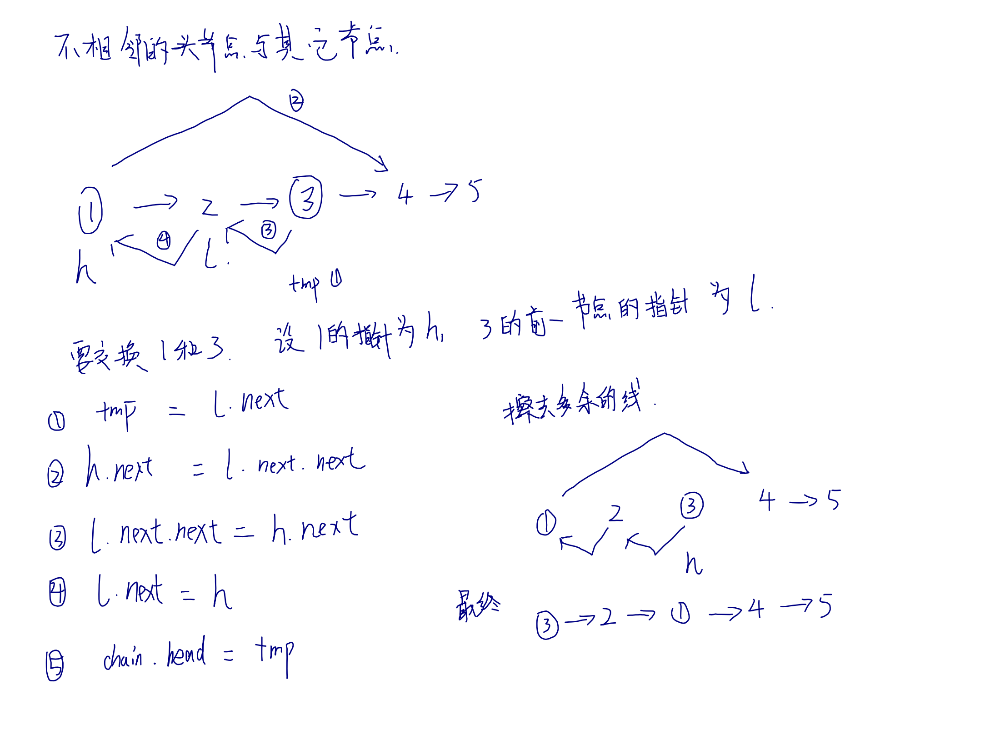
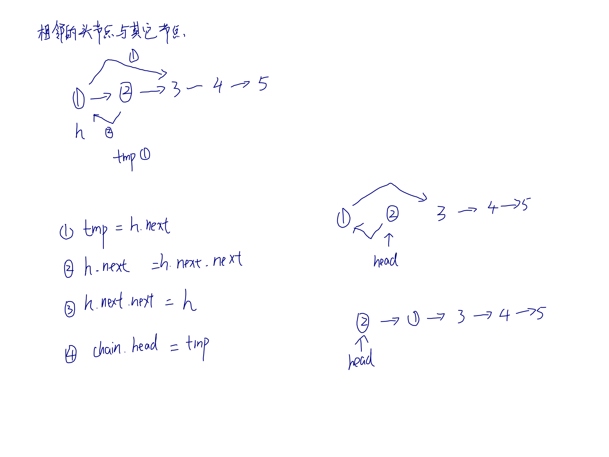
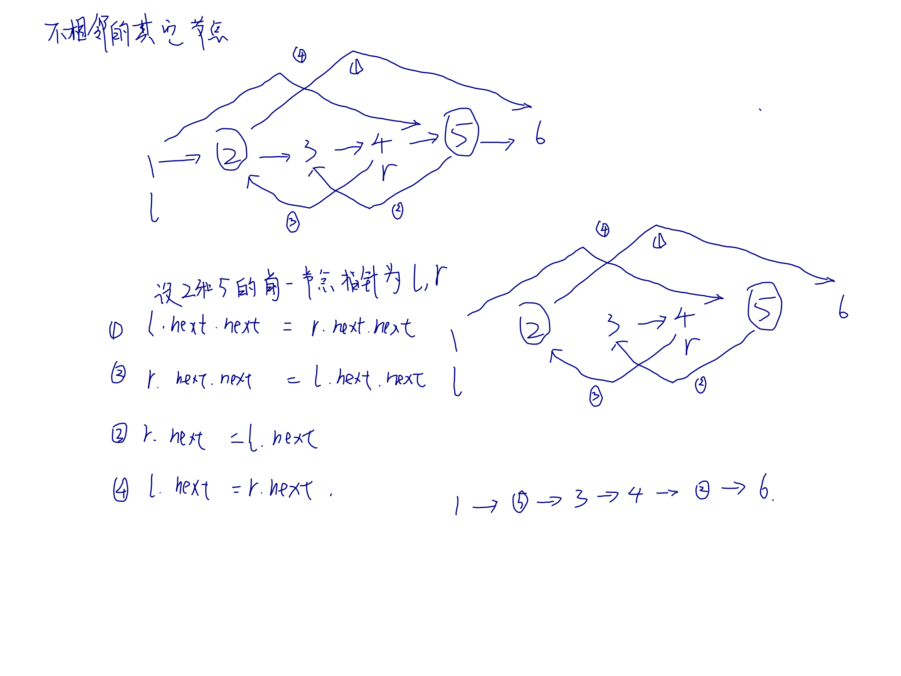
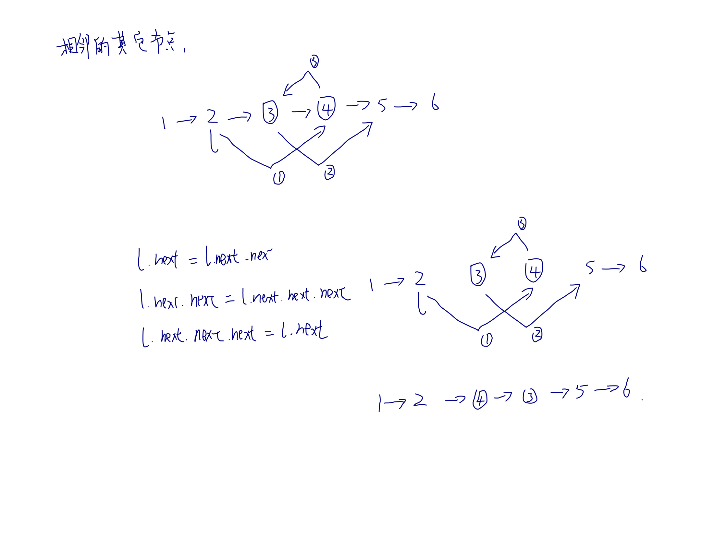

## 简述
说链表我决定还是扯上数组一起,它们都是线性存储结构,区别在于数组在`内存`上是连续的,有序的.而链表则是通过`节点`内的指针指向下个`节点`,最后把所有`节点`串起来.就好比`数组是长椅`、`链表是板凳`;你开辟一个长度为5的`数组`好比搬了一个5人坐的`长椅`过来,1个人坐是占那么多空间, 5个人坐亦然;`链`表则是1个人坐就搬1个板凳,十分灵活. 且如果你现在中间插了一个人. `长椅组`只能去找6人坐的新`长椅`了, `板凳组`的只用再搬一个`板凳`就好了. 所以`链表`的插入成本是O(1).但是`数组`也有优势, 即通过标号搜索的成本是O(1),而`链表`需要从头(head)开始遍历,成本是O(n)

<!--more-->
## 在前端的应用
查了一圈资料, 没找到链表在前端的应用场景, 据我所知, React的Vitual Dom树是用Fiber链表实现的

## 代码
[完整代码(附测试用例)](https://github.com/NgeKaworu/goLab/blob/main/struct/chain/chain.go)

### 基本结构
```go
// Chain 链表
type Chain struct {
	Head *ListNode
}


// ListNode 节点
type ListNode struct {
	Val  int
	Next *ListNode
}
```

### 构造函数
```go
// FromArr 数组转链表
func FromArr(arr []int) *Chain {
	cur := new(ListNode)
	c := &Chain{cur}
	for k, v := range arr {
		cur.Val = v
		if k != len(arr)-1 {
			cur.Next = new(ListNode)
		}
		cur = cur.Next
	}
	return c
}
```

### 增删改查 基本操作
```go
// Insert 向节点后插入
func (l *ListNode) Insert(val int) *ListNode {
	n := &ListNode{val, l.Next}
	l.Next = n
	return l
}

// InsertH 头插法
func (c *Chain) InsertH(val int) *Chain {
	l := &ListNode{val, c.Head}
	c.Head = l
	return c
}

// Insert 增
func (c *Chain) Insert(pos, val int) *Chain {
	l := c.Find(pos)
	if l != nil {
		l.Insert(val)
	} else {
		log.Fatalf("not find pos as %v", pos)
	}
	return c
}

// Remove 删除
func (c *Chain) Remove(pos int) *Chain {
	pre := c.Head
	// 头节点删除
	if pre.Val == pos {
		// 被删了的节点要赋值为空, 方便垃圾回收
		c.Head, pre.Next = pre.Next, nil
		return c
	}

	// 找目标节点上一个节点
	for pre != nil && pre.Next != nil && pre.Next.Val != pos {
		pre = pre.Next
	}

	// 如果已经是尾节点, 说明没找着
	if pre.Next == nil {
		log.Fatalf("not find pos as %v", pos)
	}

	// pre.Next是目标节点, pre.Next.Next是目标节点对下一节点的引用,设置为空可以有效出发垃圾回收
	pre.Next, pre.Next.Next = pre.Next.Next, nil
	return c
}

// Update 改
func (c *Chain) Update(pos, val int) *Chain {
	l := c.Find(pos)
	if l != nil {
		l.Val = val
	} else {
		log.Fatalf("not find pos as %v", pos)
	}
	return c
}

// Find 查
func (c *Chain) Find(val int) *ListNode {
	cur := c.Head
	for cur != nil && cur.Val != val {
		cur = cur.Next
	}

	if cur == nil {
		log.Fatalf("not find node as %v", val)
	}

	return cur
}
```

### 交换节点位置
交换这里会有四种状况, 分别是: 不相邻头节点和其它节点、相邻的头节点和其它节点、不相邻的两个其它节点、相邻的两个其它节点.  
#### 不相邻头节点和其它节点

#### 相邻的头节点和其它节点

#### 不相邻的两个其它节点

#### 相邻的两个其它节点


```go
// Swap 交换节点位置
func (c *Chain) Swap(n1, n2 int) *Chain {
	if n1 == n2 {
		log.Fatalf("same node")
	}

    cur := c.Head
    
	// 头节点处理
	if n1 == cur.Val {
		return c.HeadSwap(n2)
	}

	if n2 == cur.Val {
		return c.HeadSwap(n1)
	}

	var l1, l2 *ListNode
	// 找到要交换节点的前一个节点
	for cur.Next != nil && (l1 == nil || l2 == nil) {
		if cur.Next.Val == n1 {
			l1 = cur
		}
		if cur.Next.Val == n2 {
			l2 = cur
		}
		cur = cur.Next
	}

	if l1 == nil || l2 == nil {
		log.Fatalf("n1 or n2 not found")
	}

	// 相邻节点处理
	if l1.Val == l2.Next.Val || l2.Val == l1.Next.Val {
		front := l1
		if l2.Next.Val == l1.Val {
			front = l2
		}
		front.Next, front.Next.Next, front.Next.Next.Next = front.Next.Next, front.Next.Next.Next, front.Next
		return c
	}

	// 不相邻节点处理, 下面建议画图理解
	t := l1.Next.Next
	l1.Next.Next = l2.Next.Next
	l2.Next.Next = t
	t = l2.Next
	l2.Next = l1.Next
	l1.Next = t

	return c
}

// HeadSwap 交换头节点和目标节点位置
func (c *Chain) HeadSwap(val int) *Chain {

	cur := c.Head
	if val == cur.Val {
		log.Fatalf("%v and Head is same", val)
	}

	// 相邻处理
	if val == cur.Next.Val {
		t := cur.Next
		cur.Next, cur.Next.Next = cur.Next.Next, cur
		c.Head = t
		return c
	}

	// 找到要交换节点的前一个节点
	for cur.Next != nil && cur.Next.Val != val {
		cur = cur.Next
	}

	if cur.Next == nil {
		log.Fatalf("value as %v not found", val)
	}

	t := cur.Next
	head := c.Head
	// 交换最好做图理解, 比较绕
	head.Next, cur.Next, cur.Next.Next = cur.Next.Next, head, head.Next
	c.Head = t
	return c
}

```


### 并归排序
```go
// Sort 并归排序
func (c *Chain) Sort() *Chain {
	head := c.Head
	// 0 or 1 element.
	if head == nil || head.Next == nil {
		return c
	}
	// 2 pointers, if the fast point comes to the end, the slow one must be in the middle.
	slow, fast := head, head
	for fast != nil && fast.Next != nil && fast.Next.Next != nil {
		slow, fast = slow.Next, fast.Next.Next
	}
	// split into 2 parts.
	n := slow.Next
	slow.Next = nil
	// Sort recursivley
	merge := func(c1 *Chain, c2 *Chain) *Chain {
		node1, node2 := c1.Head, c2.Head
		// Create a new empty list.
		node := &ListNode{Val: 0}
		current := node
		// Compare one by one, put the smaller value into the new list.
		for node1 != nil && node2 != nil {
			if node1.Val <= node2.Val {
				current.Next = node1
				node1 = node1.Next
			} else {
				current.Next = node2
				node2 = node2.Next
			}
			current = current.Next
		}
		if node1 != nil {
			current.Next = node1
			node1 = node1.Next
		}
		if node2 != nil {
			current.Next = node2
			node2 = node2.Next
		}
		return &Chain{node.Next}
	}
	l1, l2 := &Chain{head}, &Chain{n}
	return merge((l1).Sort(), (l2).Sort())
}
```


